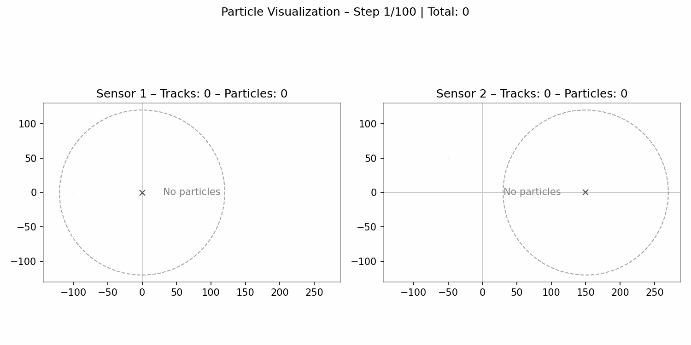
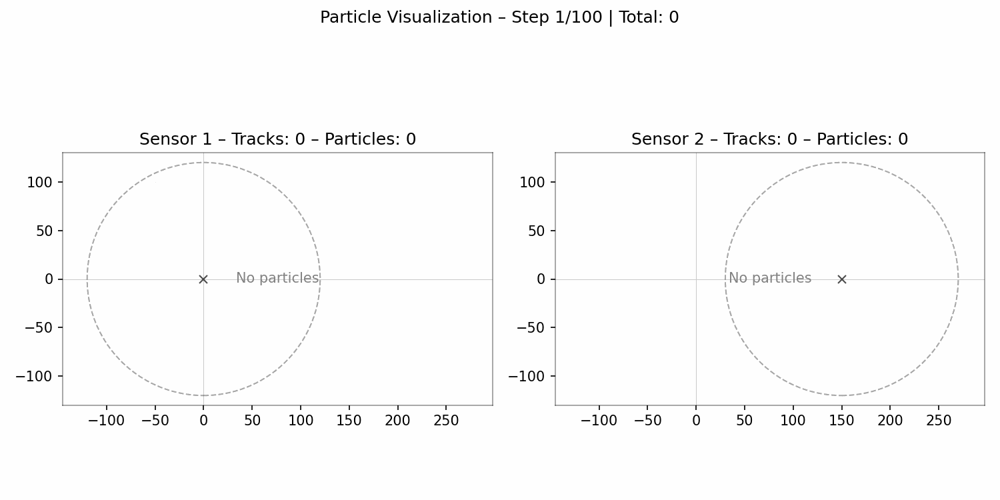
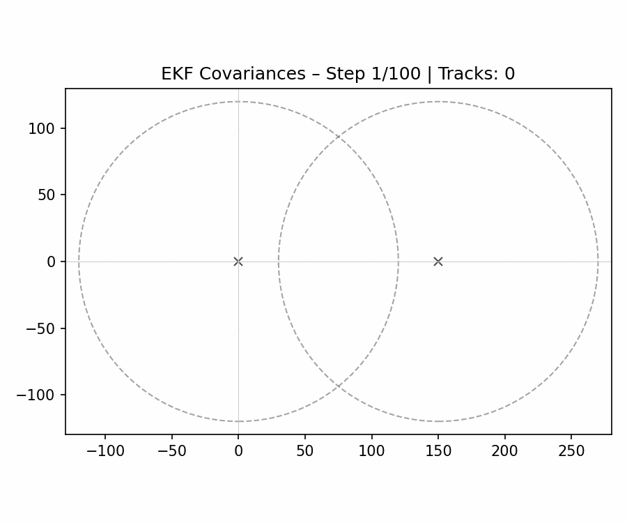
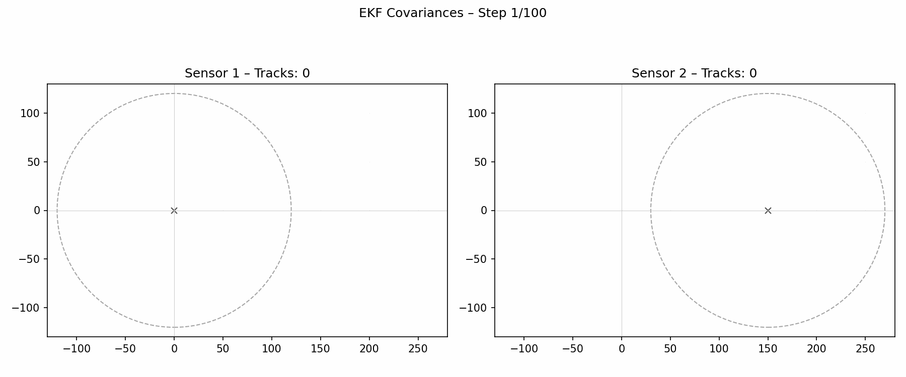

# Belief-Propagation based Target Handover in Distributed Integrated Sensing and Communication

[](https://arxiv.org/abs/2506.23118)
[](https://www.python.org/downloads/)
[](LICENSE)

This repository contains the implementation and experimental data for the paper *"Belief-Propagation based Target Handover in Distributed Integrated Sensing and Communication"* published at GlobeCom 2025. The code is adapted from [https://github.com/meyer-ucsd/EOT-TSP-21](https://github.com/meyer-ucsd/EOT-TSP-21).

## 📖 Abstract

This work presents a novel belief-propagation-based approach for target handover in distributed integrated sensing and communication (ISAC) systems. Our method enables efficient coordination between multiple base stations for seamless target tracking and handover decisions.

## 🚀 Features

- **Centralized Tracking**: Traditional centralized target tracking implementation
- **Distributed Tracking**: Distributed target tracking using belief propagation
- **Target Handover**: Intelligent handover mechanism between base stations
- **Performance Evaluation**: GOSPA metrics and comprehensive evaluation tools
- **Visualization**: Rich visualization tools for simulation results and tracking performance

## 📁 Project Structure

```
BPTargetHandover/
├── TrackerBP*.py          # Core tracking algorithms
├── centralized.py         # Centralized tracking simulation
├── distributed.py         # Distributed tracking simulation  
├── handover.py            # Handover simulation
├── Utils.py               # Utility functions
├── GOSPA.py              # GOSPA evaluation metrics
├── evaluate.py           # Performance evaluation
├── generate_data.py      # Data generation scripts
├── visualize_*.py        # Visualization scripts
├── BS*_subplots/         # Base station subplot data
└── Visualization/        # Generated visualization outputs
```

## 🛠️ Installation

1. Clone the repository:
```bash
git clone https://github.com/yourusername/BPTargetHandover.git
cd BPTargetHandover
```

2. Install required dependencies:
```bash
pip install numpy matplotlib scipy pandas
```

## 🎯 Usage

### Running Simulations

### Generating Data
This is to generate the data of 100 Experiments. 
For centralized, distributed and handover, the same dataset will be used for comparison.
```bash
python generate_data.py
```

#### Centralized Tracking
```bash
python centralized.py
```

#### Distributed Tracking
```bash
python distributed.py
```

#### Target Handover
```bash
python handover.py
```


### Evaluation
```bash
python evaluate.py
```

### Visualization
```bash
python visualize_simulation_scenario.py  # Simulation environment
python visualize_centralized_result.py   # Centralized results
python visualize_distributed_result.py   # Distributed results
python visualize_handover_result.py      # Handover results
```

## 📊 Experimental Data

The complete experimental dataset is available on Google Drive:
[Download Experimental Data](https://drive.google.com/drive/folders/1bpIiHjoyrTRWKxTBGEYVY8GV2cXb-sq6?usp=sharing)

## 🎥 Demonstrations

### Simulation Environment
[](https://www.youtube.com/watch?v=PxR27fmOcO0)

### Tracking Results (Particle-based)

| Centralized Tracking | Distributed Tracking | Target Handover |
|:-------------------:|:-------------------:|:---------------:|
|  |  |  |

### EKF Covariance Visualizations

Below are EKF-based tracking visualizations showing per-track covariance ellipses (2-sigma) instead of particle clouds.

| Centralized EKF | Distributed EKF | Handover EKF |
|:---------------:|:---------------:|:------------:|
|  |  |  |

## 📈 Performance Metrics

The project evaluates performance using:

- **GOSPA (Generalized Optimal Sub-Pattern Assignment)** metrics
- **Localization accuracy** measurements
- **False track** analysis
- **Switching cost** evaluation
- **Target handover efficiency** metrics

## 📝 Citation

If you use this code in your research, please cite our paper:

```bibtex
@inproceedings{author2025bp,
  title={Belief-Propagation based Target Handover in Distributed Integrated Sensing and Communication},
  author={Author Names},
  booktitle={IEEE Global Communications Conference (GLOBECOM)},
  year={2025},
  organization={IEEE}
}
```

## 🤝 Contributing

Contributions are welcome! Please feel free to submit a Pull Request. For major changes, please open an issue first to discuss what you would like to change.

## 📄 License

This project is licensed under the MIT License - see the [LICENSE](LICENSE) file for details.

## 📧 Contact

For questions or collaboration opportunities, please contact:
- **Primary Author**: [your.email@domain.com]
- **Project Homepage**: [https://github.com/yourusername/BPTargetHandover]

## 🙏 Acknowledgments

This work was supported by [funding source] and developed at [institution name]. We thank the reviewers and colleagues for their valuable feedback.
